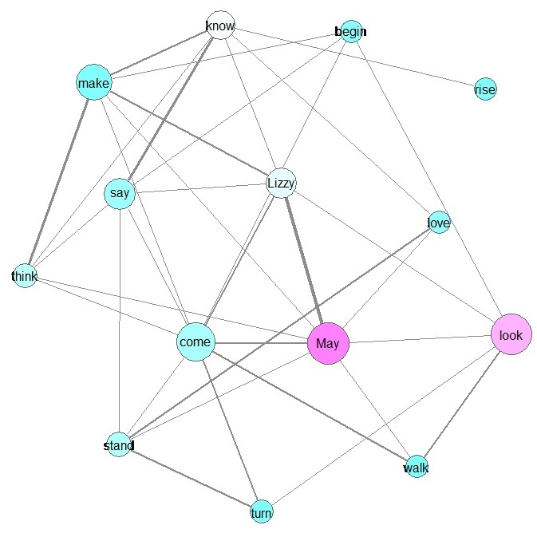

Adam Kneeland

Dr. Jentery Sayers

ENGL 507

April, 2015

Homewords—Social Spaces and Textual Landscapes of Mary Russell Mitford’s
*Our Village*

Mary Russell Mitford’s collected sketches are essentially a nostalgia
object, presented as memories and written about a rural village
chronotope that, even in the 1820s, was already becoming a thing of the
past. Mitford’s depiction of the social ecology of Three Mile Cross is
significant for its content and social context. In Mitford’s vignettes,
non-human characters are almost as central as human characters, and the
flora of the village receives almost as much attention as her
descriptions of her friends and neighbors. At the same time, Mitford
writes with what Beth Lau calls a “citational aesthetic” (1104) in which
the landscape, the people, and the plants of Three Mile Cross evoke
associations with literature. Mitford also invites her readers to
emulate the kinds of interactions and observations she experiences in
the rural space of the village. By connecting the idyllic rural society
to a landscape rife with shared literary allusions, Mitford exports the
kinds of interactions and observations so unique to Three Mile Cross.
Associating the village, its interactions, and its common flora with
enduring British literature and publishing them in a widely available
form, these forms of society gain a measure of permanency as well as
flexibility in the face of encroaching modernity.

**Social Ecology and the Ecotone of Three Mile Cross**

Mitford, extolling the virtues of the “confined locality,” writes,
“nothing is so delightful as to sit down in a country village in one of
Miss Austen’s delicious novels […] or to ramble with Mr. White over his
own parish of Selborne, and form a friendship with the fields and
coppices, as well as with the birds, mice and squirrels” (*OV* 51). She
footnotes this remark, praising White’s work (not for the last time) and
puzzling, “I wonder that no naturalist has adopted the same plan” (*OV*
51). It soon becomes clear that she herself patterns her own work after
White’s. Heidi Scott writes that Gilbert White’s “subject is not a
taxonomic group, it is a location. . . Though Selborne is not an
‘ecosystem’ in the modern biological sense . . . Selborne is a parish,
the socio-political analogue to ecosystem” (9). Mitford, too, is writing
about an ecosystem, but perhaps in an even looser sense of the term than
Scott cedes to White. Mitford’s is rather a social ecosystem than a
scientific. Her subtle positioning of her own work as a parallel to
Gilbert White’s immediately signals to her readers her intention to
explore the details of a social ecosystem.

Even upon a casual reading of Mitford’s *Our Village* one notices that a
significant part of this social ecosystem is conmprised of named and
recurring non-human characters, most notably Mitford’s greyhound
Mayflower (May). A preliminary analysis of proper noun and verb
co-occurrence in *Our Village* shows that May and Lizzy (Mitford’s young
next door neighbor) are the two most frequently mentioned characters
(Fig. 1). Moreover, May is connected to more verbs even than Lizzy.
While this visualized network of the text does not go so far as to prove
that May is an agentive animal *doing* the verbs, it does indicate that
Mitford’s nonhuman characters require further exploration. Moreover, it
shows that some are an integral part of the relationships of Three Mile
Cross. If May does not herself “love,” “look,” or “think,” she is at
least prominently situated within the web of village social life and
activity.

Figure - Co-occurrence of proper nouns and verbs; a thicker edge denotes
frequency of co-occurrence; a pink node indicates greater frequency of
use and blue less frequency; minimum term frequency is 25

Indeed, the mere fact that we can visualize Mitford’s social network and
expect to get named nonhuman characters speaks volumes about the social
experience depicted in *Our Village*. Mitford’s short pieces are written
in first person and chronicle her walks around Three Mile Cross and its
environs. A named character is almost always encountered or known to
Mitoford, and because *Our Village* is a series of vignettes few
characters are present throughout. Of those that do, however, several
are animals. Nonhuman animals occupy such a central place in Mitford’s
experience of her home that to obtain a co-occurrence visualization of
only the named human character one would have to actively ignore the
animal characters. While non-human characters in co-occurence
visualizations of literary texts are unusual, it is most likely due to a
lack of significant named non-humans in most literature rather than the
bias of those visualizing the text. This would indicate that Mitford’s
work is fairly unique; yet Mitford’s work was compared with Jane
Austen’s by her contemporaries, her vignettes discusses as the rural
equivalent of Austen’s drawing room depictions, so we know Mitford is
not simply writing (or being read) in a sub-genre of sentimental
vignette literature in which non-human characters are simply a common
trope.

The extent to which Mitford was seen as attempting a faithful account of
rural village life is indicated by contemporary criticism she received
for being too “vulgar.” John Murray censured Mitford in his *The
Quarterly Review* in 1825, objecting to a Mitford piece about hunters
and their hounds because she uses the phrase “little bitches.” Murray
recommends (with what one can only read as purse-lipped primness) that
“our fair friend. . . leave the qualities of the ‘little bitches,’ and
the gross technicalities of the sports of the field, to her coursing
acquaintance, the gentleman farmer” (Murray 168). Not only her language
but her attitude comes under fire as Murray scolds Mitford for a casual
and interested description of a hunt, saying “The worrying of the poor
timid hare should excite any emotion but pleasure in a female breast”
(Murray 168). Such details trouble the twee picturesqueness of her
village as Mitford refuses to shy away from even the less pleasant
aspect of female life.

Keeping the verisimilitude of Mitford’s sketches in mind, the presence
of non-human characters takes on a greater significance. There were
various discourses of the animal in nineteenth century literature that
may inform a reading of Mitford as well. Non-human figures are often
deployed in Victorian texts as a way to obliquely comment on human
behavior. Tess Cosslett traces this idea of animals back to Locke when
she tells us that “his L*etters to Edward Clarke on Education* (1684-91)
laments children’s cruelty to animals […] Locke uses what becomes a
standard eighteenth-century argument against cruelty to animals: that it
will lead on to cruelty to men” (Cosslett 10). More and more from this
point on, then, “[a]nimals provide a testing ground for benevolence and
humanity” (Cosslett10). Additionally, the Romantic animal signals the
potential for the development of greater understanding of self and world
more generally. Onno Oerlemans addresses the Romantic animal’s role as
both a symbol and a gesture towards the world beyond the poet: “the song
of the bird [in Wordsworth’s “The Nightingale”] is the immediate
evidence of other life that can take the poet beyond the confines of his
life and his art […] Loving nature, or knowing it, has as a preliminary
requirement the realization that there *is* life beyond human life that
is worth considering” (85). Here, an encounter with animals can change
one’s understanding of the world, and indicates an expansion of thought
and greater self-understanding.

Moreover, the conception of not only human but also nonhuman
subjectivity changed in the Victorian period, due in part to the greater
numbers of domesticated animals in everyday life. In the increasingly
urban society of the nineteenth century, animals were brought in closer
contact with a greater number of people, and Jennifer Mason sees in the
nineteenth century the great acceptance of animals as having
subjectivities of their own. She writes:

> New methods of animal training […] rendered control invisible and
> produced animals that seemed to be not just self-regulation but even
> more malleable than humans to the force of civilization. […] it grew
> increasingly easy for people to believe that the animals they
> encountered through these practices possessed or had the capacity to
> develop some of the intellectual, emotional, and moral qualities
> previously held to be exclusively human. (Mason 19)

In the nineteenth century, then, we find the trope of the noble animal
serving as a model for the pure relationship based on pure, affective
bonds. Mason explains that during the nineteenth century, “speculation
that animals living among us could become or actually had become as
mentally and morally developed as people gave way to the growing belief
that they were not just as good as us but were in many ways a great deal
better” (Mason 94). The presence of non-human characters within
Mitford’s village, then, is immediately significant. If May is a central
part of Mitford’s work, a node connected to love, mobility (“walk”) and
observation (“look”), May might serve as a model subject in Mitford’s
rural space.

We can still ask, though, whether May, especially, serves only as a
“noble animal” trope or whether she exercises any agency as a character.
On a closer reading, Mitford certainly affords May an ability to make
decisions outside of Mitford’s direction—that is, to return to the
visualization, May *does* the verbs “love” and “look” as well as
responds to the verb “come.” In the vignette “The Shaw,” Mitford
describes how May “has taken a violent affection for a most hideous
stray dog” (*OV* 149). This dog is known throughout the village as a
stray who survives by begging. May finds him and “invites” him, Mitford
says, into the stable where May sleeps and “by the activity of her
protection, and the pertinacity of her self-will [… establishes] him as
one of the family as firmly as herself” (*Ov 150)*. Because of May’s
“self-will,” the dog is accepted and given a name—Dash—and comes to be
well-liked by all. Mitford concludes: “We are all rather ashamed of him
[…] and think it necessary to explain that he is May’s pet; but amongst
ourselves, and those who are used to his appearance, he has reached the
point of favouritism in his own person” (*Ov* 151). May, then, has her
own “pet,” choosing a friend in a social act outside of Mitford’s own
sphere of influence and even changing the human characters’ minds as
they come to like her “pet.” That is, May is a character, capable of
forming her own affectionate social bonds with others.

May is not the only creature to whom a personality is attributed.
Mitford is remarkable for the way she extends similar capacities of
subjectivity to even those unnamed, non-pet creatures. Pets were given a
special place in Victorian culture. Teresa Mangum discusses the
phenomenon of pet memorialization in the nineteenth century and, like
Mason, traces the growing perception of pets as creatures capable of
feeling. She writes that “in order to accept grief as a legitimate
response to an animal’s death, Victorians first needed to believe that
animals themselves were capable of love—that should ‘we’ be the first to
go that the animal would grieve the loss of ‘us’” (Mangum 19). This
emphasis on the emotional capacities of pets, though, often resulted in
a stronger denial of subjectivity to non-pets: “Those who ‘loved’
animals doomed most. . . to misery when they demarcated and exalted a
few species as ‘pets’” (Mangum 18).

Even Mitford’s barnyard fowl, though, are capable of feeling and
idiosyncrasies. She writes that “all domestic animals [meaning non-pet
livestock] dislike children, partly from an instinctive fear of their
tricks […] partly, I suspect, from jealousy” (*OV* 112). Mitford admits
that “jealousy seems a strange tragic passion to attribute to the
inmates of the basse-cour” (112). She describes a rooster who refuses to
accept food from a farmer’s child and instead goes to the child’s mother
and, receiving “a dole from her hand, […] swells out his feathers […]
and struts and crows and pecks, proudest and happiest of bantams” (*OV*
112).

The way in which Mitford backs up her admittedly strange assertion of
tragic passion in among domestic fowl (and her own dog) is through an
appeal to experience. Mitford acts throughout her sketches as a
trustworthy guide, beginning the collection with an invitation: “Will
you walk with me through our village, courteous reader” (*OV* 51)? As
our guide she supports her descriptions with first-hand evidence,
indicated through invitations to her readers to “only look at that
strutting fellow” and “See, she is calling to him and feeding him, and
now how he swells out his feathers” (*OV* 112). Returning to parallels
between Three Mile Cross and Gilbert White’s Selborne, the naturalists’
knowledge and Mitford’s knowledge both are borne of long experience with
a single place rather than any official credentials. Just as Gilbert
White supports his amateur naturalist’s writing with decades of
first-hand observation, so are Mitford’s observations about the world
supported by her status as an established resident of Three Mile Cross.
Mitford, then, is our guide and the mediator of our experience of her
village, and the reader tacitly agrees to accept Mitford as an authority
when they accept her introductory invitation to “walk with her.”

Finally, Mitford attributes a social significance and respect even to
the wild creatures of Three Mile Cross. Indeed, Three Mile Cross is a
place where the wild and the domestic can encounter one another. Mitford
notes the intelligence of rooks compared to domestic fowl. “There is
something very intelligent in the ways of that black people the rooks,
[…] a sort of collective and corporate wisdom” (*OV* 173). We’ve spoiled
the geese with domestications, she says, but the “rooks are free
commoners of nature, who use the habitations we provide for them, tenant
our groves […] but never dream of becoming our subjects” (173). The use
of the word “free commoners” has association s of rural commons and, by
extension, the politically contentious acts of enclosure that occurred
throughout the eighteenth and nineteenth century and which were often
seen as a particularly egregious sign of modernity’s erosion of
traditional English values and ways of life. In Mitford’s Three Mile
Cross, however, there is still common ground, an ability to encounter
undomesticated creatures “at home,” as it were.

This ability to encounter wild animals is something that Mitford
suggests could happen even outside the rural space of Three Mile Cross.
Mitford recalls, “We used, before we lived in a street, to fix a little
board outside the parlour window, and cover it with bread crumbs in the
hard weather” (*OV* 69). Mitford is describing a crude form of a bird
feeder. The earliest “commercially made” bird feeder wasn’t sold until
the mid 1920s (Wilcox et al. 1), and feeding birds doesn’t seem be a
common practice before the twentieth century. Yet here Mitford describes
the species of birds that the bread crumbs attracted, and even tells us
of one individual, a “saucy fellow of a blackbird [… who] used to tap
his yellow bill against the window for more. How we loved the fearless
confidence of that fine, frank-hearted creature! And surely he loved us.
I wonder the practice is not more general” (*OV* 69 & 70). Even if such
interactions are most readily available to those in rural situations
(after all, the bird feeder was set up “before we lived in a street”),
the species she mentions are common throughout England, present even in
our own contemporary London. By noting that the practice could be “more
general” and specifically discussing common species Mitford indicates
that such spaces of encounter could be created elsewhere, that the kind
of experience through which Mitford guides us in her writing is
available to her readers wherever they are.

**Poetry in the Soil—The Space of the Village and Citational
Aesthetics**

A space of encounter, then, is essential to these encounters but it
isn’t fixed, it can be recreated. Readers can cultivate Mitford-ian
attitudes, interactions, and spaces wherever they are. This is really
driven home by Mitford’s treatment of plant life. Although more
difficult to visualize, the plants of Mitford’s rural landscape entwine
themselves throughout her social relationships and interactions. A
simple topic model of Mitford’s text, however, illustrates the
prevalence of plants almost as well as a visualization:

> 0    -1.001    honest motion stamped thin sounds cheerful wear sporting weary warmth holly sturdy straggling smiling death clock post state water 
> 
> 1    -1.001    completely woodbine macready holding hath shape mistress rick filling afternoon mine shrine queen dark lanes simplicity apt fall wives 
> 
> 2    -1.001    miss mitford good beautiful great day pretty house long white poor life lizzy time trees village side father flowers 
> 
> 3    -1.001    books spreading timber expected emerald hollyhocks worthy understand youth dance sharing tremulous scolding hears closely precious walton mimic awed 
> 
> 4    -1.001    hidden send orange thickly stood heaven whip strain ready dinner briony hardy pulling merits ditch haunt mistress obstinacy branch 
> 
> 5    -1.001    stand favour future rapidly duration sloping nook style dignity possessed america chance rising coach innocent admiration devotion moving resignation 
> 
> 6    -1.001    faster human instrument lawn branches frugal cure opposite worth nightingale progress terrible press woods sex difficult ways letter grazing 
> 
> 7    -1.001    walk fly expression daughter won begins complexion fearless brick doubt quiet dress abode fame hearted cowper witness prosperous worst 
> 
> 8    -1.001    shouting vie grave return desire discovered disturb bounding marry stream returning pheasant destitution leaning beat train descending wet aquatic 
> 
> 9    -1.001    formed romantic mile scenes houses admired sorts fairies begun hedgehog embosomed palms tufts tint catch odour desolation cradle bushes 
> 
> 10    -1.001    hue table samuel rushes specimen waggon pattens live kemble tufted affronted feminine weed bipeds sloping porch hole lands gin 
> 
> 11    -1.001    lips gipsy instinct called grounds kennel humoured falls wishes scene sadly engaged imagine proper sold set attend bought admiration
> 
> 12    -1.001    describes picking pat redbreast mouth proceed attention doubt defined gown list curls mr imperceptibly wedding youngest proceeded separated ground 
> 
> 13    -1.001    daddy mossy rogue wet blossomed season bare tenant happened speaking drawing enthusiastic woman back james life mrs great intensity 
> 
> 14    -1.001    god fallen wit suppose indoors thaw woody constable warrant laid la sign distinction imagine books fluttering personage august distant 

In this table we can see the 15 most statistically significant topics in
the text, or “a list of words that occur in statistically meaningful
ways” (Graham et al.). More than any particular deduction regarding what
*Our Village* is about, the most interesting aspect of each topic
cluster is the presence of “plant words” in almost all of them. Some are
general, like “flowers,” “branch”, or “mossy”; others, though, are
specific varieties of plants like “woodbine” or “holly.” This makes
sense, considering Mitford’s vivid evocation of the rural setting and
the fact that many of Mitford’s most detailed social interactions in her
sketches involve going out to gather or draw flowers. For example, in
“The Wood” Mitford leads her friend Ellen G. out to find wood-sorrel.
“She never saw that most elegant plant,” Mitford says (*OV* 98). Ellen
plans to draw the plant, and Mitford says “that the introduction will be
a mutual benefit; Ellen will gain a subject […] and the pretty weed will
live […] duration is the only charm which it wants, and that Ellen will
give it” (98). In this outing Mitford is, of course, the guide, the one
who knows what to look for, the one already acquainted with the plant,
once again modeling the type of awareness needed to experience the type
of interactions Mitford describes. In this case, the plants of the
village are, much like the animals, an essential element of the
relationships of the village.

This prominence of familiar plants (wood sorrel is common throughout
Europe) is what conversely makes the idyllic interactions of the village
transferable to other places, that frees it from the status of a lost
casualty of modernity. This is where Mitford’s “citational aesthetic”
becomes a central part of her text, and some theory of literary tourism
may help here. The culture of literary tourism was more or less an
attempt to commune with, or at least better appreciate, well known
authors. Paul Westover explains that “literary tourism inherits and
transforms codes from the cult of the Picturesque. Focusing on locations
where landscape overlaps with history and poetry, its aesthetic requires
the traveler to ‘see’ literature in the material world” (“Literary
Tourism” 303). Like the aesthetic standards of the picturesque, in which
travelers would frequently evaluate real-life scenery to see if it
measured up to artistic standards, the standards of the literary tourist
required the viewer to know what the appropriate affective and
intellectual responses were to a grave or a historical site, and to
evaluate the effect of such a site by those standards. This aesthetic
lens is similar to what Mitford models for her readers—an observant eye
and a literary background enable her to draw parallels between Three
Mile Cross and well-known pieces of literature that would be familiar to
her readers.

Dierdre Lynch picks up on the topic of Mitford’s citational aesthetic
and posits that, because the references to Shakespeare and Cowper are so
casually frequent in Mitford’s vignettes, Lynch says that Mitford poses
the act of “loving literature […] as an activity akin got the
chronicling of everyday routines and local attachments” (1104). Mitford
is asserting a “literary landscape as home ground” (Lynch 1104), for in
Mitford’s walks “local-colorism may at any moment come to a halt,
because the nightingale's song reminds the author of poems she loves or
because certain roses are for her associated with Shakespeare, in whose
day they were planted” (Lynch 1105). We see this when during a walk
Mitford extols the beauty of the rural countryside and then notes,
“Cowper has described it for me. How perpetually, as we walk in the
country, his vivid pictures recur to the memory” (*OVG*). Mitford’s
careful observations of the natural and social are consistently
“footnoted” with digressions of how the village scenes/inhabitants/flora
remind Mitford of major literary figures. Readers can then participate
in Mitford’s village, enjoying membership in an imagined community all
of whom understand her references and are familiar with the common
species of birds and flowers that she encounters. Thus her readers can
themselves have such reveries about beloved poetry as a part of their
own daily lives in any space where the appropriate plants grow—that is,
everywhere— provided they are, like Mitford, observant and well-read
enough to make the connection.

This tendency to see literature in landscape allowed tourists a
consistent point of orientation. In the changing landscape of the
nineteenth century, Ann Wallace suggests that “everyone lived as if they
were traveling” (72). Lynch adds that “the rights of way taken for
granted in local communities’ rounds of laboring, marketing and visiting
were the first casualties of the rage for enclosure” (1106). In the
midst of eco-social change and urbanization, however, even those readers
without access to the rural spaces like Three Mile Cross can potentially
experience and preserve the same forms of subjectivity as Mitford
because of their participation in a shared natural and cultural
touchstone of enduring British literature.

Literature might in this sense provide a stabilizing force in the face
of a developing modernity, providing elements of the shared and familiar
even in a physically changing space. Any given village may undergo
physical alteration, but cultural values are preserved through
literature and through seeing where that literature is embodied in the
landscape.

The way a flower, for example, can embody these values is evident in a
passage at the beginning of “The Widow’s Dog,” a vignette similar to
those in *Our Village* but published separately. Mitford is describing
in pastoral detail a neighboring village of Ashley End. When she
mentions “the delicate harebell” (“Widow’s Dog” 3) there is a long
footnote in which Mitford describes a visit from an American who has
never encountered primroses before. She describes how the American finds
the flowers for the first time, those “blossom of a thousand
associations—the flower sacred to Milton and Shakspeare [sic]” (“Widow’s
Dog” 4), and how, realizing it as the flower so often mentioned by the
great British authors, he actually kneels down to gather a bunch of the
flowers “with a reverential expression which I shall not easily forget,
as if the flower were to him an embodiment of the great poets by whom it
has been consecrated to fame” (4).

The flowers have become not simply a reminder of great literature, not
even a simple symbol, but a tangible piece of major British culture, the
literary manifested in the material. The flowers preserve and allow
access the affective connection to literature that will best enable one
to remember and emulate the values such literature contains. Mitford’s
literature points us to the flowers, which point right back to
Shakespeare and Milton. Even if Three Mile Cross is enclosed and
unrecognizably altered, a Mitfordian subjectivity will still be
possible.

**Conclusion**

In her careful depictions of Three Mile Cross Mitford connects a
vulnerable space to enduring authors and tropes. Her village is a place
of connection and coexistence, between classes and species, an idyllic
and quintessentially British space. Additionally, it is a place where
one can develop the subjectivity that can empathize with a tree or form
an honest friendship, a “pure relationship,” with a dog. By connecting
such interactions and subjectivities to common varieties of flora and
fauna and to familiar and enduring pieces of literature, Mitford assures
that even if the endangered rural space of the village is lost the
experiences possible in that space will not be. Mitford can be seen, I
think, as reminding Britons of what they may want to preserve. By
frequently evoking culturally valued pieces of literature and their
authors her own experience are more easily identified with and shared.
By indications that her own experiences—bird feeding, for example—could
be done elsewhere, she makes the values and relationships something that
can be taken out of the village and appreciated in even in more urban
settings.

**Works Cited**

Godwin, William. “Essay on Sepulchres.” *Department of Urban
Archaeology*. 2005. Web. Accessed 23 April 2013.

Shawn Graham , Scott Weingart and Ian Milligan. “Getting Started with
Topic Modeling and MALLET.” *The Programming Historian* , 2012. Web. 11
April 2015.

Jones, Christian Kenyon. “British Romanticism and Animals.” *Literature
Compass* 6.1 (2009): 136-152. Print.

Killick, Tim. “Mary Russell Mitford and the Topography of Short
Fiction.” *Journal of the Short Story in English.* 43 (2004): 11-28.
Web. Accessed 23 April 2013

Lynch, Deidre. “Homes and Haunts: Austen’s and Mitford’s Literary
Style.” *PMLA* 115.5 (2000): 1103-1108. Web. Accessed 23 April 2013

Mangum, Teresa. “Animal Angst: Victorians Memorialize their Pets.”
*Victorian Animal Dreams: Representations of Animals in Victorian
Literature and Culture*. Ed. Deborah Morse and Martin Danahay.
Burlington, VT: Ashgate, 2007. 15-34. Print.

Mason, Jennifer. *Civilized creatures: Urban Animals, Sentimental
Culture, and American Literature, 1850-1900*. Baltimore: Johns Hopkins
University Press, 2005

McKusick, James. *Green Writing: Romanticism and Ecology*. New York:
Palgrave and MacMillan, 2010. Print

Mitford, Mary Russell. *Our Village*. iTunes (based on 1893 text)

*--Our Village*. *Project Gutenberg*. n. p. n.d. Project Gutenberg. Web.
12 Sep 2015.

--“The Widow’s Dog.” N.p. n.d. iTunes.

Oerlemans, Onno. *Romanticism and the Materiality of Nature*. Toronto:
University of Toronto Press, 2002. Print

Morrison, Kevin A. “Elizabeth Barrett Browning’s Dog Days.” *Tulsa
Studies in Women’s Literature* 30.1 (2011): 93-115. Web. Accessed 23
April 2013

Murray, John. * The Quarterly Review: Vol. XXXI*. London: John Murray,
1824. Web.

Scott, Heidi. "Apocalypse Narrative, Chaotic System: Gilbert White's
Natural History Of Selborne And Modern Ecology." *Romanticism And
Victorianism On The Net* 56 (2009): *MLA International Bibliography*.
Web. 23 Apr. 2013.

Westover, Paul. *Necromanticism: Travelling to Meet the Dead,
1750-1860.* New York: Palgrave and MacMillan, 2012. Print

-- “William Godwin, Literary Tourism, and the Work of Necromanticsm.”
*Studies in Romanticism* 48.2 (2009): 299-319. Web. Accessed 23 April
2013

Wilcox, Emma V.; Hostetler, Mark E.; Main, Martin B.; Voigt, Maena;
“Attracting Backyard Birds: Bird Feeder Selection.”
http://edis.ifas.ufl.edu/uw192

