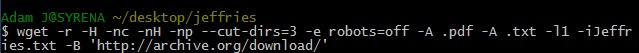

Cheats
======

##Git Bash command

**touch documentname.docType** -- Creates a document in current
directory

**git remote -v** -- verifies location and destination repository 

**git clone GitHubRepository** -- Clones a GitHub repository into your
current location (desktop, e.g.)

**git add --all** -- adds changes made in a repository to the GitHub
server

**git commit -m "label"** Logs a change with the repository on the
surver

**git push origin master** -- Uploads changes on a local document on the
corresponding document in GitHub server (prompts request for username
and password)

**git pull** -- downloads changes on a server document to the
corresponding local document (must be in corresponding directory?)

**ls** -- shows files contained in current directory

**mkdir** -- create a directory in current location

**mkdir NewFolderName** -- self explanatory

**rm FileName OR Directory Name** -- delete file

### ls optional modifiers
**-1** -- List 1 item per line

**-a** -- Show Everything, including hidden items

**-d** -- list only directories

**-l** -- Use a long listing format (more info per item, arranged in columns, vertical listing)

##Command Line

**Pandoc conversion** -- `pandoc -o filename.desiredfiletype filename.currentfiletype`

**cd ..** -- go up one level in a directory.

### Wget commands
**-r** -- Recursive retrieval, downloads linked pages to a depth of five sites; "an endurance command" - Dr. Sayers

**--no-parent** -- limits recursive retrieval to the last parent directory

**-ls s** -- specifies the number of links you want to follow.

**-w 10** -- 10 specifies the seconds to wait between server requests. 

**––random-wait** -- randomly varies the time between server requests between .5 and 1.5 seconds

**--limit-rate=20k** -- limits bandwith required of a server 

** -H -- span hosts, i.e., follows/downloads a link even if it has a dif. host.

**-m** -- mirrors an entire website

**-nc** -- no clobber!; doesn't repeat files already on the computer. 

**-nH** -- no directory; skips main directory, gets all the files without the "tree structure"

**-np** -- no parent; don't go back to "main tree" if the websites attempts to redirect. 

**--cut-dirs=3** -- cut directories; gets a folder with a bunch of files, doesn't mimic the websites organization

**-e robots=off** -- bypasses the robot fence, i.e., the txt file anticipating robots

**-A .txt (or .pdf etc)** -- Accept .filetype; gets only files of these types. 

**-l1** level one in recursivity; specifies how many levels down to go when encountering a recursive robot. Max is 5, the default

**-i filename.filetype** -- pulls files from specified file.filetype

**-B url.com** -- begin with [base url]

##Sources/links: 

[Basic Git Command Line for Windows](http://www.codeproject.com/Articles/457305/Basic-Git-Command-Line-Reference-for-Windows-Users "A solid resource of basic commands")

##Markdown
--------

**Hash** -- marks as a header (extra hashes creates sub headings)

**hypertext** -- `[desired title](FileName.md)`

**code sans format** -- `desired code here`

**Link** `[title!](address.com"HoverNote")`

**italics** -- `*italics*`

**Bold text** -- `**Bold**`

**Block text** -- `>Blocktext`

**Image** -- ``

**ctrl + Shift + P** -- command palette (use for browser previews, e.g.)